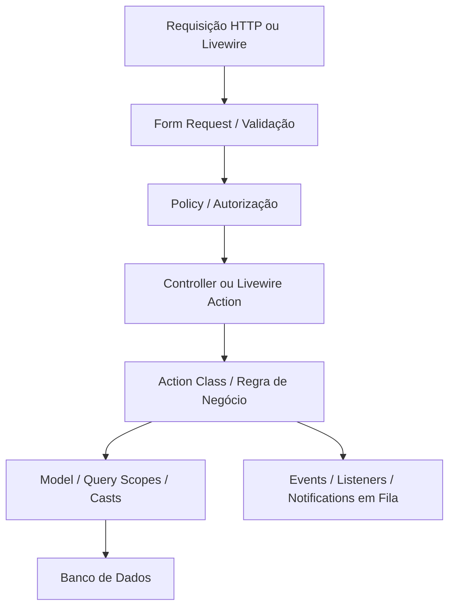

# 🏛️ Guia de Estudo: Arquitetura Moderna no Laravel

## 1. Indo Além do "Controller Gordo + Model Gigante"

No início do aprendizado de Laravel, é comum ver todo o código enfiado dentro do Controller:
- Validação manual `$request->validate(...)`
- Checagem de permissão `if ($user->role...)`
- Criação de registros com relacionamentos em cascata
- Envio de e-mails, disparos de notificações e logs
- Formatação de respostas

**O resultado?** Controllers com 500 linhas de código, difíceis de testar, impossíveis de reaproveitar no Livewire ou em Comandos de Terminal (`artisan`).

---

## 2. A Caixa de Ferramentas da Arquitetura Moderna



---

## 3. As Camadas e Suas Responsabilidades

### 3.1. Form Requests: Validação Desacoplada e Inteligente
Em vez de validar dentro do controller, crie uma classe dedicada:

```bash
php artisan make:request StoreTaskRequest
```

```php
namespace App\Http\Requests;

use App\Enums\TaskPriority;
use App\Enums\TaskStatus;
use Illuminate\Foundation\Http\FormRequest;
use Illuminate\Validation\Rule;

class StoreTaskRequest extends FormRequest
{
    public function authorize(): bool
    {
        return $this->user()->can('create', Task::class);
    }

    public function rules(): array
    {
        return [
            'title' => ['required', 'string', 'max:255'],
            'description' => ['nullable', 'string'],
            'status' => ['required', Rule::enum(TaskStatus::class)],
            'priority' => ['required', Rule::enum(TaskPriority::class)],
            'deadline_at' => ['nullable', 'date', 'after:today'],
        ];
    }

    /**
     * Limpa ou ajusta dados antes da validação rodar:
     */
    protected function prepareForValidation(): void
    {
        $this->merge([
            'title' => trim(strip_tags($this->title ?? '')),
        ]);
    }
}
```

---

### 3.2. Action Classes: Regras de Negócio Reutilizáveis
Uma **Action** é uma classe com uma única responsabilidade (Single Responsibility Principle).

**Por que usar?**
Se você precisa criar uma tarefa a partir de:
1. Uma requisição Web comum (Controller)
2. Um componente Livewire
3. Um comando agendado no cron (`schedule`)
4. Um webhook externo

Você não quer duplicar a lógica de criação! Você chama a mesma **Action**:

```php
namespace App\Actions\Tasks;

use App\Enums\TaskStatus;
use App\Models\Task;
use App\Models\User;
use Illuminate\Support\Facades\DB;

class CreateTaskAction
{
    public function execute(User $creator, array $data): Task
    {
        return DB::transaction(function () use ($creator, $data) {
            $task = $creator->tasks()->create([
                'title' => $data['title'],
                'description' => $data['description'] ?? null,
                'status' => $data['status'] ?? TaskStatus::Pending,
                'priority' => $data['priority'],
                'deadline_at' => $data['deadline_at'] ?? null,
            ]);

            // Se tiver anexos, notificações ou logs, acontecem aqui dentro!
            // Event::dispatch(new TaskCreatedEvent($task));

            return $task;
        });
    }
}
```

---

### 3.3. Eloquent Scopes e Custom Builders: Queries Limpas e Expressivas

Em vez de repetir `where('status', 'pending')->where('deadline_at', '<', now())` por todo o sistema:

### Na Model:
```php
use App\Enums\TaskStatus;
use Illuminate\Database\Eloquent\Builder;

class Task extends Model
{
    /**
     * Scope para tarefas atrasadas.
     */
    public function scopeOverdue(Builder $query): void
    {
        $query->where('status', '!=', TaskStatus::Completed)
              ->where('deadline_at', '<', now());
    }

    /**
     * Scope para filtrar por prioridade.
     */
    public function scopeOfPriority(Builder $query, TaskPriority $priority): void
    {
        $query->where('priority', $priority);
    }
}
```

### No seu código (Fica legível como prosa inglesa):
```php
// Busca tarefas atrasadas de alta prioridade:
$urgentTasks = Task::query()
    ->overdue()
    ->ofPriority(TaskPriority::High)
    ->get();
```

---

### 3.4. Observers vs Model Events

Se você precisa executar ações automáticas sempre que um registro for criado/atualizado (ex: gerar slug, auditar quem modificou, limpar cache):

```bash
php artisan make:observer TaskObserver --model=Task
```

```php
namespace App\Observers;

use App\Models\Task;
use Illuminate\Support\Str;

class TaskObserver
{
    public function creating(Task $task): void
    {
        if (empty($task->uuid)) {
            $task->uuid = (string) Str::uuid();
        }
    }

    public function updated(Task $task): void
    {
        if ($task->wasChanged('status')) {
            // Logar alteração de status para histórico
        }
    }
}
```

---

## 4. Comparativo de Quando Usar Cada Recurso

| Necessidade | Onde Colocar? | Ferramenta Recomendada |
| :--- | :--- | :--- |
| Validar dados do formulário | Camada de Entrada HTTP | `FormRequest` ou `#[Validate]` no Livewire |
| Decidir quem pode executar uma ação | Segurança / Autorização | `Policy` |
| Executar lógica de negócio reutilizável | Camada de Domínio | `Action Class` |
| Filtrar queries de forma reutilizável | Camada de Dados | `Eloquent Local Scope` |
| Efeitos colaterais automáticos do banco | Ciclo de Vida do Model | `Observer` ou `Model Events` |
| Transformar dados brutos do banco | Apresentação / Tipagem | `Eloquent Casts` e `Enums` |
