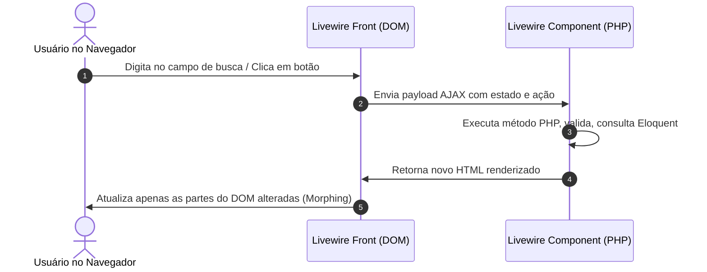

# ⚡ Guia de Estudo: Livewire do Zero ao Avançado

## 1. A Mudança de Mentalidade: O Que é o Livewire?

### 👴 A dor do desenvolvimento web clássico:
- **Antes (Blade Tradicional):** Qualquer clique ou filtro exigia um recarregamento completo da página (`F5`), quebrando a fluidez do usuário.
- **Ou (SPAs com Vue/React + API REST):** Você precisava criar uma API REST inteira em Laravel, autenticação por tokens (Sanctum), duplicar validações no front (TypeScript/Zod) e no back, gerenciar estado complexo com Vuex/Redux/Pinia.

### 🌟 A Mágica do Livewire:
O **Livewire** permite criar interfaces **dinâmicas, reativas e ricas** diretamente com PHP e Blade, sem precisar escrever uma única linha de JavaScript ou criar endpoints de API avulsos.



---

## 2. Anatomia de um Componente Livewire Moderno (v3+)

Criando um componente:
```bash
php artisan make:livewire TaskList
```

Isso gera dois arquivos:
1. `app/Livewire/TaskList.php` (Classe PHP de lógica e estado)
2. `resources/views/livewire/task-list.blade.php` (Template Blade reativo)

### Classe PHP (`app/Livewire/TaskList.php`):

```php
namespace App\Livewire;

use App\Enums\TaskStatus;
use App\Models\Task;
use Livewire\Attributes\Computed;
use Livewire\Attributes\Locked;
use Livewire\Attributes\Url;
use Livewire\Attributes\Validate;
use Livewire\Component;
use Livewire\WithPagination;

class TaskList extends Component
{
    use WithPagination; // Paginação reativa sem reload de página

    // 🔗 #[Url]: Mantém a busca sincronizada com a query string do navegador (?search=laravel)
    #[Url(history: true)]
    public string $search = '';

    #[Url]
    public ?string $statusFilter = null;

    // 🔒 #[Locked]: Propriedade não pode ser adulterada pelo cliente no front-end
    #[Locked]
    public int $projectId;

    // 🛡️ #[Validate]: Validação declarativa moderna via Attributes do PHP 8
    #[Validate('required|min:3|max:255', message: [
        'required' => 'O título da tarefa é obrigatório.',
        'min' => 'O título deve ter no mínimo 3 caracteres.',
    ])]
    public string $newTitle = '';

    /**
     * Ciclo de Vida: mount() executa UMA VEZ na inicialização do componente.
     */
    public function mount(int $projectId): void
    {
        $this->projectId = $projectId;
    }

    /**
     * 💡 #[Computed]: Propriedade computada com cache automático na mesma requisição!
     */
    #[Computed]
    public function tasks()
    {
        return Task::query()
            ->where('project_id', $this->projectId)
            ->when($this->search, fn ($q) => $q->where('title', 'like', "%{$this->search}%"))
            ->when($this->statusFilter, fn ($q) => $q->where('status', $this->statusFilter))
            ->latest()
            ->paginate(10);
    }

    /**
     * Ação: Criação de nova tarefa com validação instantânea.
     */
    public function createTask(): void
    {
        // 1. Roda a validação dos atributos #[Validate]
        $this->validate();

        // 2. Autorização via Policy
        $this->authorize('create', Task::class);

        // 3. Salva no banco
        Task::create([
            'project_id' => $this->projectId,
            'title' => $this->newTitle,
            'status' => TaskStatus::Pending,
            'user_id' => auth()->id(),
        ]);

        // 4. Limpa o campo
        $this->reset('newTitle');

        // 5. 📢 Dispara evento global para outros componentes (ex: toast ou contador)
        $this->dispatch('notify', message: 'Tarefa criada com sucesso!', type: 'success');
    }

    /**
     * Renderização do template Blade
     */
    public function render()
    {
        return view('livewire.task-list');
    }
}
```

---

### Template Blade (`resources/views/livewire/task-list.blade.php`):

```blade
<div class="space-y-6">
    <!-- Barra de Filtros e Busca em Tempo Real -->
    <div class="flex items-center gap-4">
        <!-- wire:model.live.debounce: Atualiza conforme digita, esperando 300ms -->
        <input 
            type="text" 
            wire:model.live.debounce.300ms="search" 
            placeholder="Buscar tarefas..."
            class="input-modern"
        />

        <!-- Filtro de Status -->
        <select wire:model.live="statusFilter" class="select-modern">
            <option value="">Todos os Status</option>
            @foreach(App\Enums\TaskStatus::cases() as $status)
                <option value="{{ $status->value }}">{{ $status->label() }}</option>
            @endforeach
        </select>
    </div>

    <!-- Formulário Rápido de Criação -->
    <form wire:submit="createTask" class="flex gap-2">
        <input 
            type="text" 
            wire:model="newTitle" 
            placeholder="Nova tarefa..."
            class="input-modern"
        />
        
        <!-- wire:loading desabilita o botão enquanto a requisição roda -->
        <button type="submit" wire:loading.attr="disabled" class="btn-primary">
            <span wire:loading.remove>Adicionar</span>
            <span wire:loading>Salvando...</span>
        </button>
    </form>
    @error('newTitle') <span class="text-red-500 text-sm">{{ $message }}</span> @enderror

    <!-- Lista de Tarefas Renderizada -->
    <div class="space-y-2">
        @forelse($this->tasks as $task)
            <div wire:key="task-{{ $task->id }}" class="card-item flex justify-between items-center">
                <span>{{ $task->title }}</span>
                <span class="badge badge-{{ $task->status->badgeColor() }}">
                    {{ $task->status->label() }}
                </span>
            </div>
        @empty
            <p class="text-gray-500">Nenhuma tarefa encontrada.</p>
        @endforelse
    </div>

    <!-- Paginação Reativa -->
    {{ $this->tasks->links() }}
</div>
```

---

## 3. Principais Diretivas do Livewire para Dominar

| Diretiva | O que faz | Exemplo |
| :--- | :--- | :--- |
| `wire:model` | Liga o input à propriedade PHP (atualiza no submit/blur). | `wire:model="title"` |
| `wire:model.live` | Atualiza a cada tecla digitada (tempo real). | `wire:model.live="search"` |
| `wire:model.live.debounce.300ms` | Espera o usuário parar de digitar por 300ms antes de enviar a requisição (economiza chamadas). | `wire:model.live.debounce.300ms="search"` |
| `wire:click` | Executa um método PHP no clique. | `wire:click="deleteTask({{ $task->id }})"` |
| `wire:submit` | Executa um método PHP no envio do form (já previne o reload padrão). | `wire:submit="save"` |
| `wire:loading` | Exibe elementos apenas enquanto a requisição AJAX estiver acontecendo. | `<span wire:loading>Carregando...</span>` |
| `wire:key` | **Obrigatório em loops `@foreach`**: identifica elementos únicos para morphing perfeito do HTML. | `<div wire:key="item-{{ $item->id }}">` |

---

## 4. Comunicação Entre Componentes (Eventos)

### Componente Emissor:
```php
$this->dispatch('task-status-updated', taskId: $task->id, newStatus: $task->status->value);
```

### Componente Ouvinte:
```php
use Livewire\Attributes\On;

class NotificationBell extends Component
{
    #[On('task-status-updated')]
    public function handleTaskStatus($taskId, $newStatus): void
    {
        // Atualiza notificações na barra superior sem recarregar!
    }
}
```

---

## 5. Cuidados e Boas Práticas no Livewire

1. **Evite colocar Models Eloquent pesadas inteiras em propriedades públicas:** Prefira IDs (`public int $taskId`) ou Propriedades Computadas (`#[Computed]`). Isso reduz o tamanho do payload trafegado entre navegador e servidor.
2. **Sempre use `wire:key` em loops:** Sem `wire:key`, o algoritmo de atualização do DOM pode misturar inputs ou estados visuais.
3. **Sempre autorize dentro dos métodos:** Nunca presuma que porque o botão está oculto a ação não pode ser chamada via inspeção de rede. Use `$this->authorize()`.
