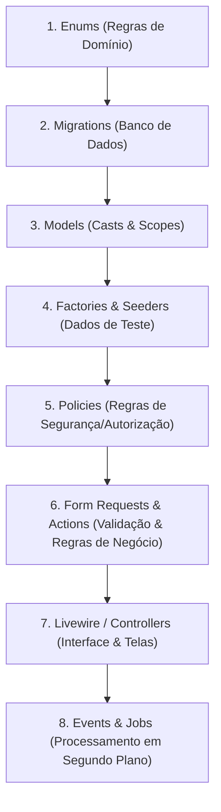
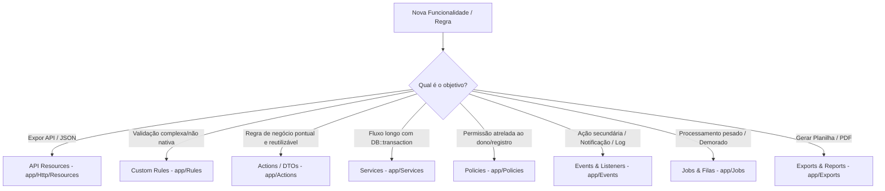

# 📌 Guia de Padrões, Boas Práticas & Fluxo de Desenvolvimento

> **🎯 Regra de Ouro:** O Controller só recebe a requisição, chama o fluxo/camada responsável e devolve a resposta. Mantenha os métodos curtos, expressivos e com tipagem estrita no PHP 8+.

---

## 🏗️ A Sequência de Ouro (Fluxo à Prova de Retrabalho)

Para evitar ter que ficar voltando para alterar arquivos criados anteriormente, siga sempre esta ordem de desenvolvimento orientada a domínio (Domain-First):

### 📋 Por que essa ordem funciona perfeitamente?

1. **Passo 1: Enums (`app/Enums/`):** Define os valores fixos do negócio (status, roles, prioridades).
2. **Passo 2: Migrations (`database/migrations/`):** Cria as tabelas já usando os Enums nos valores padrão (`->default(UserRole::Client->value)`), sem strings soltas.
3. **Passo 3: Models (`app/Models/`):** Configura os Casts automáticos (`casts()`), relacionamentos e Scopes com tipos seguros.
4. **Passo 4: Factories & Seeders (`database/factories/` e `database/seeders/`):** Cria geradores de dados fictícios que já utilizam as Models e Enums prontos.
5. **Passo 5: Policies (`app/Policies/`):** Define as regras de quem pode criar, editar ou excluir registros com base nos papéis e donos.
6. **Passo 6: Form Requests & Actions (`app/Http/Requests/` e `app/Actions/`):** Valida os dados de entrada com `Rule::enum()` e encapsula a lógica em classes reutilizáveis com `DB::transaction`.
7. **Passo 7: Livewire / Telas (`app/Livewire/`):** Constrói a interface reativa que consome as Models, Actions e Policies já testadas e blindadas.
8. **Passo 8: Jobs, Filas e Eventos (`app/Jobs/` e `app/Events/`):** Adiciona tarefas secundárias e assíncronas (e-mails, logs de auditoria) em background.

---

## 🟢 1. Obrigatórios (Usar Sempre no Dia a Dia)

Estes recursos são a base de qualquer projeto Laravel moderno e devem ser adotados como padrão inicial:

### 1.1. Enums Tipados (`app/Enums/`)
- **Quando usar:** Sempre que houver valores fixos e finitos no banco de dados (ex: `status`, `roles`, `tipos`, `prioridades`).
- **Por quê:** Elimina erros de digitação (*typos*), centraliza regras (como labels, cores de badge, transições de estado) e habilita autocomplete total no editor.
- **Nunca faça:** `if ($user->role === 'adimin')` ou `$table->enum('status', ['a', 'b'])` soltos.

### 1.2. Models Modernos (`app/Models/`)
- **Quando usar:** Em todas as entidades do banco.
- **O que incluir:**
  - Casts no método moderno `protected function casts(): array` (em vez da propriedade `$casts`).
  - Relacionamentos com retorno de tipo explícito (ex: `public function tasks(): HasMany`).
  - Acessores/Mutadores modernos com a classe `Attribute` ou Casts dedicados.

### 1.3. Form Requests (`app/Http/Requests/`)
- **Quando usar:** Em qualquer formulário ou requisição HTTP que receba dados de entrada.
- **Por quê:** Tira a validação de dentro do Controller, permite tratar dados antes da validação (`prepareForValidation`) e autorizar a requisição no próprio Request (`authorize()`).

---

## 🟡 2. Sob Demanda (Usar Conforme a Necessidade da Regra)

Nem todo projeto precisa de todas as ferramentas ao mesmo tempo. Use a ferramenta certa para a dor certa:

---

### 2.1. API Resources (`app/Http/Resources/`)
- **Quando usar:** Apenas quando a aplicação expuser endpoints de API / JSON.
- **Por quê:** Transforma Models em respostas JSON customizadas, ocultando campos sensíveis (como hashes e tokens) e padronizando formatos de data e moeda para consumo por aplicativos móveis ou front-ends externos.

### 2.2. Rules Customizadas (`app/Rules/`)
- **Quando usar:** Validações de regras de negócio específicas que o Laravel não possui nativamente (ex: CPF/CNPJ, chave Pix, validação em API externa).
- **Como criar:** `php artisan make:rule ValidCpf`.

### 2.3. Actions e DTOs (`app/Actions/` e `app/DTOs/`)
- **Actions:** Classes com responsabilidade única (`execute()`) que executam uma regra de negócio específica (ex: `CreateTaskAction`, `CancelSubscriptionAction`).
- **DTOs (Data Transfer Objects):** Objetos tipados e imutáveis com `readonly` do PHP 8.2+ para transportar dados estruturados entre camadas sem depender do array solto `$request->all()`.

### 2.4. Services (`app/Services/`)
- **Quando usar:** Quando uma rotina envolver múltiplos passos coordenados, integração com múltiplos gateways ou transações complexas no banco (`DB::transaction`).
- **Exemplo:** `CheckoutService`, `PaymentGatewayService`.

### 2.5. Policies (`app/Policies/`)
- **Quando usar:** Quando a autorização depender do contexto ou do dono de um registro específico (ex: "só o criador ou o admin pode editar esta tarefa").
- **Por quê:** Centraliza as regras de segurança fora dos Controllers, Views e Livewire.

### 2.6. Events & Listeners (`app/Events/` e `app/Listeners/`)
- **Quando usar:** Para ações secundárias e efeitos colaterais desacoplados.
- **Exemplo:** Quando uma tarefa é concluída:
  - Evento: `TaskCompleted`
  - Listener 1: `SendTaskNotificationToProjectManager`
  - Listener 2: `LogTaskAuditHistory`

### 2.7. Jobs & Filas (`app/Jobs/`)
- **Quando usar:** Processamentos pesados ou operações lentas que não podem travar o carregamento da tela para o usuário final.
- **Exemplo:** Envio de e-mails em lote, processamento de imagens/vídeos, importação de CSVs com milhares de linhas.

### 2.8. Exports & PDFs (`app/Exports/`)
- **Quando usar:** Exclusivamente quando houver telas para gerar planilhas (Excel/CSV) ou relatórios em PDF para download.

---

## 📋 Resumo Rápido de Decisão

| Dúvida / Situação | Onde colocar? |
| :--- | :--- |
| Onde valido se o título foi preenchido? | `FormRequest` ou `#[Validate]` no Livewire |
| Onde defino os status possíveis de um pedido? | `Enum` em `app/Enums/` |
| Onde defino que uma coluna JSON vira objeto? | Método `casts()` no `Model` |
| Onde verifico se o usuário logado é o autor do post? | `Policy` em `app/Policies/` |
| Onde coloco a rotina de finalizar pedido que mexe em estoque e financeiro? | `Action` ou `Service` com `DB::transaction` |
| Onde disparo o e-mail de boas-vindas sem travar a tela de cadastro? | `Job` colocado na fila (`ShouldQueue`) |
