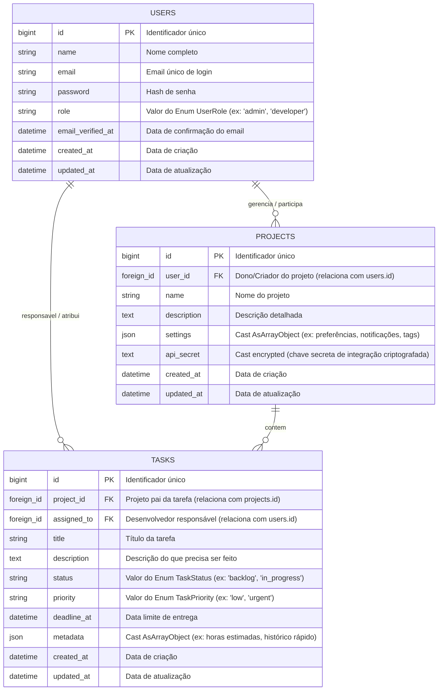

# 📌 Visão Geral do Projeto TaskForge & Estrutura do Banco de Dados

> **Resumo para consulta rápida e planejamento no Trello.**

---

## 🎯 1. O Projeto: TaskForge

O **TaskForge** é um sistema moderno de **Gestão Inteligente de Projetos e Chamados** (estilo Jira / Trello com Kanban reativo).

### Principais Pilares:
1. **Níveis de Acesso & Perfis:** Administrador, Gerente de Projetos, Desenvolvedor e Cliente.
2. **Ciclo de Vida de Tarefas:** Estados com regras de transição (Backlog -> Em Andamento -> Em Revisão -> Concluída / Cancelada).
3. **Segurança & Políticas:** Permissões baseadas em papéis (Policies e Gates).
4. **Interface Reativa (Livewire):** Filtros instantâneos, quadro Kanban, modais sem recarregar a página e validação em tempo real.
5. **Recursos Modernos do Eloquent:** Casts em Enums, objetos JSON nativos (`AsArrayObject`) e dados sensíveis criptografados (`encrypted`).

---

## 🗄️ 2. Diagrama Entidade-Relacionamento (ERD)

---

## 📊 3. Resumo das Tabelas do Banco de Dados

### 👤 Tabela: `users`
| Coluna | Tipo | Finalidade | Cast / Enum |
| :--- | :--- | :--- | :--- |
| `id` | `BIGINT (PK)` | ID único do usuário | - |
| `name` | `VARCHAR` | Nome do usuário | `string` |
| `email` | `VARCHAR` | Email único de autenticação | `string` |
| `password` | `VARCHAR` | Senha criptografada | `hashed` |
| `role` | `VARCHAR` | Papel no sistema | `UserRole` (Enum) |
| `email_verified_at` | `DATETIME` | Confirmação de email | `datetime` |

---

### 📂 Tabela: `projects`
| Coluna | Tipo | Finalidade | Cast / Enum |
| :--- | :--- | :--- | :--- |
| `id` | `BIGINT (PK)` | ID único do projeto | - |
| `user_id` | `BIGINT (FK)` | Dono/Gerente do projeto | Relação `belongsTo(User)` |
| `name` | `VARCHAR` | Nome do projeto | `string` |
| `description` | `TEXT` | Detalhes do escopo do projeto | `string` |
| `settings` | `JSON` | Configurações customizadas do projeto | `AsArrayObject` (JSON nativo) |
| `api_secret` | `TEXT` | Chave de webhook/integração | `encrypted` (Criptografia no banco) |

---

### 📝 Tabela: `tasks`
| Coluna | Tipo | Finalidade | Cast / Enum |
| :--- | :--- | :--- | :--- |
| `id` | `BIGINT (PK)` | ID único da tarefa | - |
| `project_id` | `BIGINT (FK)` | Projeto ao qual pertence | Relação `belongsTo(Project)` |
| `assigned_to` | `BIGINT (FK)` | Usuário encarregado da tarefa | Relação `belongsTo(User)` (nullable) |
| `title` | `VARCHAR` | Título do chamado/tarefa | `string` |
| `description` | `TEXT` | Detalhes do que deve ser feito | `string` |
| `status` | `VARCHAR` | Estado atual da tarefa | `TaskStatus` (Enum) |
| `priority` | `VARCHAR` | Urgência da tarefa | `TaskPriority` (Enum) |
| `deadline_at` | `DATETIME` | Data limite de entrega | `datetime` (nullable) |
| `metadata` | `JSON` | Horas gastas, etiquetas e extras | `AsArrayObject` (JSON nativo) |

---

## 🧩 4. Os Enums Integrados

1. **`UserRole`**: `Admin` (`'admin'`), `ProjectManager` (`'manager'`), `Developer` (`'developer'`), `Client` (`'client'`)
2. **`TaskStatus`**: `Backlog` (`'backlog'`), `InProgress` (`'in_progress'`), `InReview` (`'in_review'`), `Completed` (`'completed'`), `Cancelled` (`'cancelled'`)
3. **`TaskPriority`**: `Low` (`'low'`), `Medium` (`'medium'`), `High` (`'high'`), `Urgent` (`'urgent'`)
